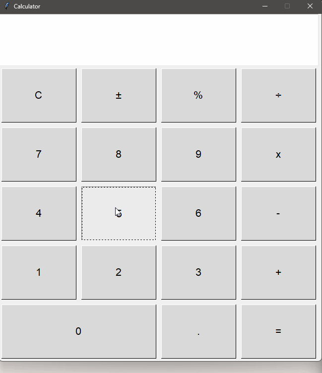

# GUI Calculator

Woah - buttons and stuff

### Demo

## How to use this thing

### Pre-Reqs

---

Have python installed on your compopo

### Steps to run

---

1. Download the calc.py file
2. Enter `python /path/to/calc.py`
3. Press buttons, try to break it
