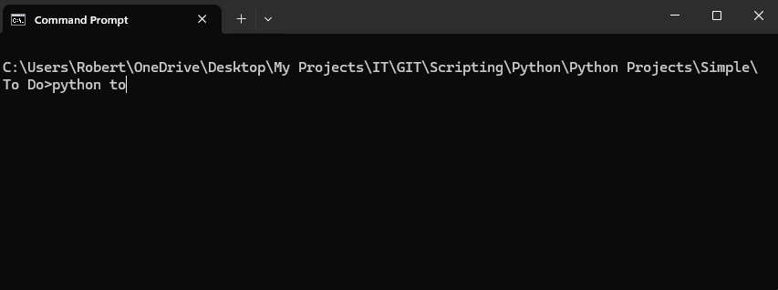

# THE TO DO APP

What was on my list again?

### Demo

### Pre-Reqs

---

Have python installed on your compopo

### Steps to run

---

1. Download the todo.py file
2. `cd` to the repository where todo.py lives
3. Enter `python todo.py --help`
4. Check out the available arguments
5. Do some things
